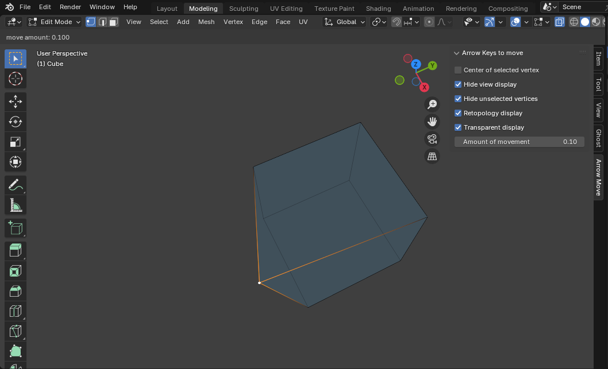

# Blender Add-on: Arrow Keys to move

編集モードで選択した頂点、辺、面をカーソルキーで移動するアドオンです。
Gキーでの移動とは異なり、編集中に視点移動ができるため結果を確認しながら編集できます。

## インストール

詳細は [INSTALL](docs/INSTALL.md) を確認してください。

## 使用例
編集モードで頂点等を選択してカーソルキーを押下します。

カーソル移動中も視点の移動、回転、拡大ができます。
（テンキーのショートカットも使用可能）
また、Rキーでリトポロジー表示、Xキーで透過表示を切り替えます。

マウス左クリック、ENTERキー等で移動を確定します。マウス右クリック、ESCキーでキャンセルします。

## 機能

### 選択頂点の中央

- カーソル移動時に原点を選択頂点の中央に設定します。

### ビュー表示を隠す

- カーソル移動時に床、X、Y軸、3Dカーソルを一時的に非表示にします。

### 非選択の頂点を隠す

- カーソル移動時に非選択の頂点を一時的に非表示にします。

### リトポロジー表示

- 'R'キーで表示切替
  または、ナビゲーションバーの「リトポロジー表示」をチェックで切替

### 透過表示

- 'X'キーで表示切替
  または、ナビゲーションバーの「透過表示」をチェックで切替

### 移動量の設定

- ナビゲーションバーの「カーソル移動」から移動量を設定できます。
  （デフォルト値 0.1）
　※CTRL＋マウスホイールで増減できます。

